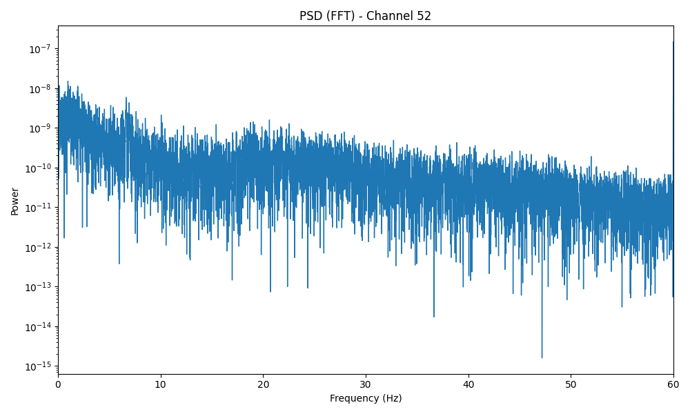
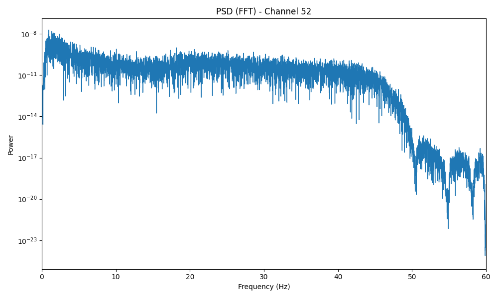

# total-perspective-vortex

/home/gkrusta/tpv/.venv/bin/python3 pca.py


# Prepeare data 
```
python3 preprocess.py
```
## PSD
**before**  
frequency filtering, noise removal and averaging amoung eeg signals is applied.  



**after**


# Train model